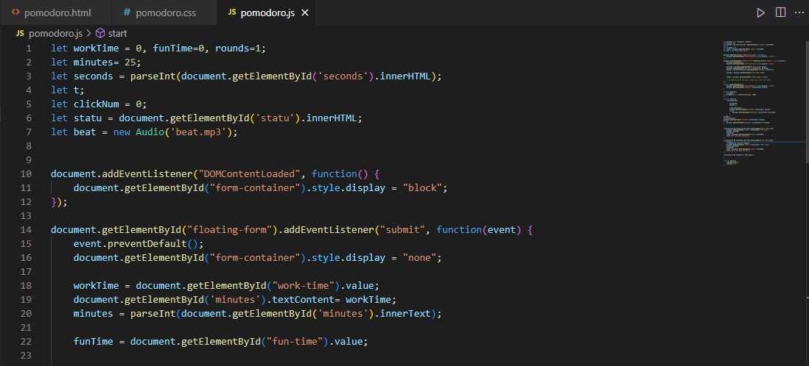
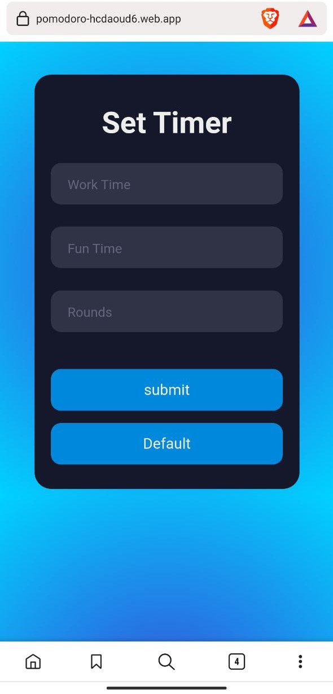

# Pomodoro General

A Pomodoro is a time management technique that helps users improve their productivity by dividing their time into focused work intervals and short breaks.

# This Project

Used firebase to host the projet:  https://pomodoro-hcdaoud6.web.app/

This project is built using HTML for the structure and layout, CSS for styling, and JavaScript for functionality and user interaction. 

The project will ask the user for the length of the work interval and the length of the break in minutes, and have a default button that sets the work interval to 25 minutes and the break to 5 minutes.

Responsie for phones also

 

